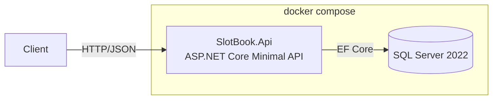

# SlotBook

A resource booking API — meeting rooms and desks. Built with .NET 10, ASP.NET Core, EF Core
and SQL Server.

> **Status: in development.**

The interesting part is not the CRUD. It is that **two people cannot book the same room for
the same time**, and that this is proven by a test which fires concurrent requests at a real
SQL Server and asserts exactly one succeeds.

## Run it

```bash
cp .env.example .env      # then edit MSSQL_SA_PASSWORD
docker compose up -d
```

API at `http://localhost:8080`, OpenAPI UI at `http://localhost:8080/scalar`.

## Architecture



Three projects:

| Project | Contains |
| --- | --- |
| `SlotBook.Core` | Entities and booking rules. No framework dependencies. |
| `SlotBook.Infrastructure` | `DbContext`, EF Core configuration, migrations. |
| `SlotBook.Api` | Minimal API endpoints, DI and hosting. |

No CQRS, no MediatR, no repository layer over `DbContext` — deliberately.
See [ADR-0001](docs/decisions/0001-three-projects-no-mediatr.md).

## Tests

```bash
dotnet test
```

Booking rules are unit-tested in `SlotBook.Core.Tests`. The overlap rule is exercised by
integration tests against a real SQL Server started by
[Testcontainers](https://dotnet.testcontainers.org/) — the EF Core in-memory provider
enforces neither constraints nor transactions, so it cannot test the rule this project is
about.

## Design decisions

Short ADRs in [`docs/decisions/`](docs/decisions/).
