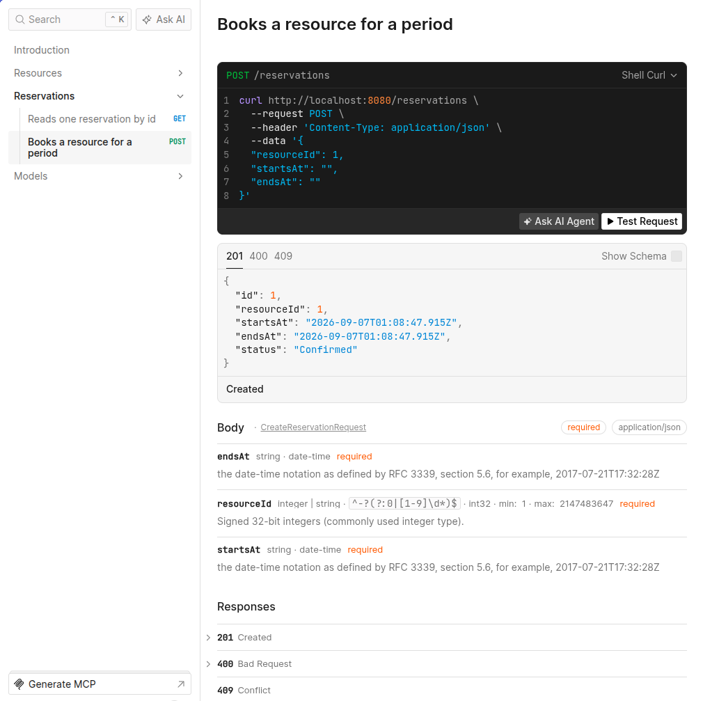
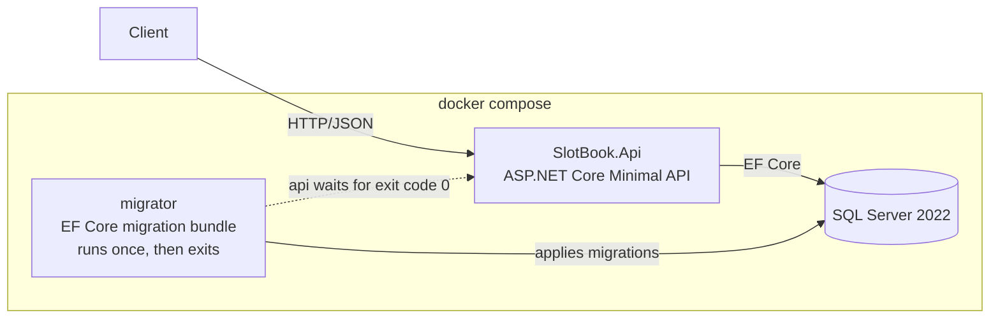

# SlotBook

A resource booking API — meeting rooms and desks. Built with .NET 10, ASP.NET Core, EF Core
and SQL Server.

> **Status: in development.**

The interesting part is not the CRUD. It is that **two people cannot book the same room for
the same time**, and that the rule is enforced by a constraint in the database rather than by
a check in application code — a difference that only shows itself under concurrent writes,
and only against a real database.

A booking is stored as one row per quarter hour it occupies, under a key that a second booking
for the same quarter hour cannot repeat. That is why periods have to start and end on a fifteen
minute boundary, and why nothing in the handler compares one period with another. The reasoning,
with the two locking designs that lost, is in
[ADR-0003](docs/decisions/0003-preventing-double-booking.md).

## Run it

```bash
cp .env.example .env      # then edit MSSQL_SA_PASSWORD
docker compose up -d
```

API at `http://localhost:8080`, OpenAPI UI at `http://localhost:8080/scalar`.

Compose brings up three services. `migrator` applies pending EF Core migrations and exits;
the API starts only once it has exited successfully, so the schema is never changed by the
process that is about to serve traffic.

## API reference

Scalar renders the OpenAPI document the API publishes at `/openapi/v1.json`. None of it is
written by hand — the status codes and their schemas come from the endpoints' own metadata.



## Architecture



Three projects:

| Project | Contains |
| --- | --- |
| `SlotBook.Core` | Entities and booking rules. No framework dependencies. |
| `SlotBook.Infrastructure` | `DbContext`, EF Core configuration, migrations. |
| `SlotBook.Api` | Minimal API endpoints, DI and hosting. |

No CQRS, no MediatR, no repository layer over `DbContext` — deliberately.
See [ADR-0001](docs/decisions/0001-three-projects-no-mediatr.md).

## Tests

```bash
dotnet test
```

The suite runs against a real SQL Server started by
[Testcontainers](https://dotnet.testcontainers.org/), in CI as well as locally. The EF Core
in-memory provider enforces neither constraints nor transactions, so it cannot settle the
question this project is about: whether the database itself refuses the second booking. See
[ADR-0004](docs/decisions/0004-testcontainers-over-in-memory.md).

The flagship case is `ConcurrentBookingTests`: eight requests ask for the same hour at the same
moment, and exactly one gets `201 Created`. The other seven get `409 Conflict`, which they can
only get after the database has refused a duplicate key. The test also counts the surviving
rows, because status codes alone would pass a handler that reported a conflict and wrote
anyway.

## Design decisions

Short ADRs in [`docs/decisions/`](docs/decisions/).
