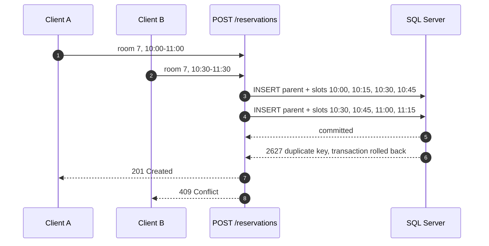

# ADR-0003: Preventing double booking

**Status:** Accepted · 2026-09-07

## Context

No two reservations may overlap on the same resource, and the rule has to hold when several
clients ask for one period at the same moment.

PostgreSQL states such a rule in a line of DDL, with an exclusion constraint over a range
type. SQL Server has no equivalent, so the enforcement mechanism decides the shape of the
table — a decision that had to come before the entity.

- **Check before insert in the handler.** A query answers for the moment it ran, and another
  writer fits into the gap before the `INSERT`. Measured on this code with eight simultaneous
  requests for one hour: in eight rounds out of ten, all seven losing requests passed the
  lookup and were stopped only by the database.
- **`sp_getapplock` keyed on the resource.** How EF Core guards migrations. Declined because
  it protects only the callers who ask for the lock.
- **One row per reservation, read under `SELECT … WITH (UPDLOCK, HOLDLOCK)` in a
  transaction.** Correct, and the simplest schema of the three: `HOLDLOCK` locks the range
  with its gaps, so the second writer waits rather than slipping in. Declined on cost — LINQ
  emits no table hint, so the rule's one place drops to `FromSql`; the range lock needs an
  index on `(ResourceId, StartsAt)` or it escalates; and the test would then prove a lock held
  in time rather than a database refusing a row.

## Decision

A reservation is stored as a parent row plus one child row per quarter hour it occupies.
`ReservationSlot` has the composite primary key `(ResourceId, SlotIndex)`, where `SlotIndex`
counts fifteen-minute quanta from a fixed origin in UTC. Overlap becomes duplication, and the
key rejects it.

Parent and children go in one `SaveChangesAsync`, so they share a transaction and a clash on
the third quarter hour rolls the whole booking back. SQL Server answers 2627, which becomes
`409 Conflict` through the same predicate that already answers a duplicate resource name.
Nothing in application code compares periods.

A unique key is checked as the row lands rather than against a reader's snapshot, so no
particular isolation level is required: read committed snapshot, which EF Core enables on a
database it creates, answers the same as anything stricter.

## Consequences

- Reservations must fall on the grid: 10:05 is refused with a `400` rather than rounded, which
  makes the grid a rule of the product and not a detail of storage. Responses carry periods and
  never a `SlotIndex`, so the quantum stays changeable without a new API version.
- Child rows are the only source of truth about availability, so no query consults a parent's
  status and none may assume a reservation has children. Cancellation, when it arrives, is a
  delete of those rows: the period returns to the pool at once and the parent stays as a
  record.
- Rows grow with duration: a desk booked for a working day is 32 of them in one insert, which
  is what a maximum-duration rule would bound.
- Overlapping requests for *different* periods insert shared keys in different orders and can
  deadlock; identical periods cannot, since their keys go in in the same order. Error 1205 is
  untranslated today and would surface as a `500`.
- `ConcurrentBookingTests` fires eight simultaneous requests for one hour and asserts exactly
  one `201`, seven `409`, and the surviving rows — against SQL Server in a container
  (ADR-0004), because an in-process fake could not fail it.
